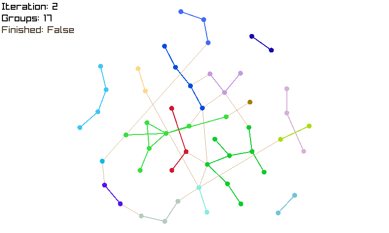
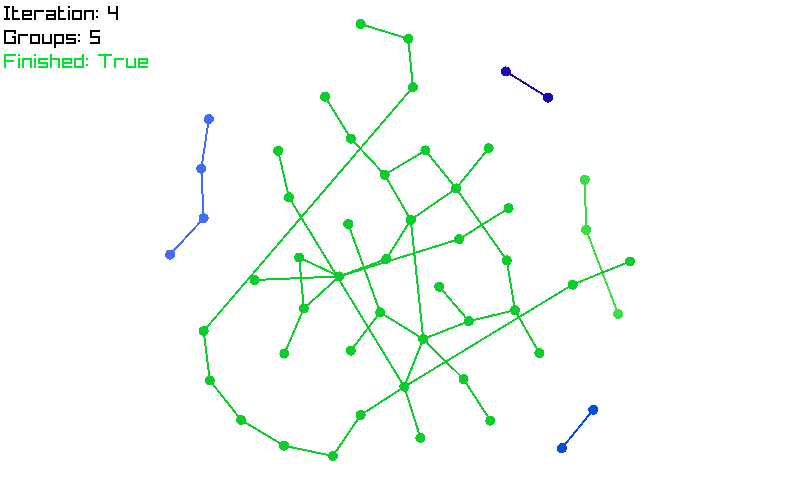

# Visual demonstration of Boruvka's algorithm in C#

This is a small C# application written with [Raylib](https://www.raylib.com/),
that demonstrates how [Borůvka's algorithm](https://en.wikipedia.org/wiki/Bor%C5%AFvka%27s_algorithm) can be used to check that a given graph is disjoint or not.

The application also contains a small gradient descent solver for automatically untangling the graphs, which is quite pleasing to watch in action.

Here are a few screenshots of it in action:





## Running this project

To run this project, simply clone it and use the `dotnet` command-line utility to run the code:

```sh
git clone https://github.com/adri326/boruvka-cs
cd boruvka-cs
dotnet run
```

Press the left mouse button to make the algorithm run for one round (or reset once it's finished), and press the right mouse button to generate a new random graph.
